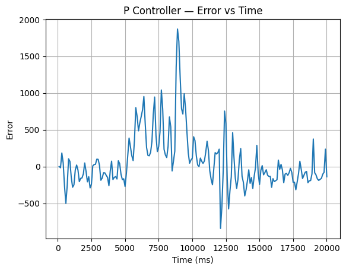
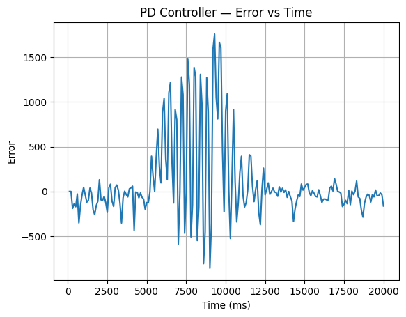
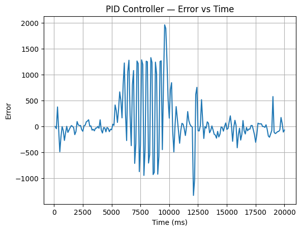

# Lab 4 – PID Line Following Robot

## Course
**ENGR-E 321 – Advanced Cyber-Physical Systems**

## Team Members
- Jaiden Medina  
- Brady Adams  

---

# Project Overview

This project implements a **PID-based line following controller** on the **Romi 32U4 robot**. The robot uses a **QTR reflectance sensor array** to detect the position of a black line on the track and adjusts the motor speeds to remain centered on the line.

The goal of this lab was to:

- Implement a **PID control loop**
- Tune **P, PD, and PID controllers**
- Log controller performance data
- Graph **error vs time**
- Determine the **fastest reliable line following strategy**

---

# Hardware

## Robot Platform
- Romi 32U4 Robot

## Sensors
- Pololu QTR Reflectance Sensor Array (6 sensors used)

## Actuators
- Romi DC Motors

## Additional Components
- LCD Display  
- Buzzer  
- Button A  

---

# Software Architecture

The robot operates in three main states:

```
WAIT_CALIBRATE
WAIT_START
RUNNING
```

### WAIT_CALIBRATE
The robot waits for the user to press **Button A** to begin sensor calibration.

### WAIT_START
After calibration, the robot waits to be placed on the track and started.

### RUNNING
The PID controller runs continuously and the robot actively follows the line.

---

# PID Control Loop

The control loop performs the following steps:

```
1. Read line position from the sensor array
2. Compute tracking error relative to the center of the robot
3. Calculate P, I, and D terms
4. Compute the correction value
5. Adjust left and right motor speeds
6. Log error and motor speeds
```

---

# PID Gains

The tuned controller gains used in the final implementation were:

```
Kp = 0.04
Ki = 0.0005
Kd = 0.02
```

The controller output is calculated as:

```
correction = P + I + D
```

Motor commands are calculated using differential steering:

```
leftSpeed  = baseSpeed - correction
rightSpeed = baseSpeed + correction
```

This causes the robot to steer back toward the center of the line.

---

# Controller Experiments

Three controller configurations were tested.

---

## P Controller

Configuration:

```
Kp > 0
Ki = 0
Kd = 0
```

Characteristics:

- Fast response
- Large oscillations
- Overshoot during turns

---

## PD Controller

Configuration:

```
Kp > 0
Ki = 0
Kd > 0
```

Characteristics:

- Reduced oscillation
- Faster stabilization
- Improved turning performance

---

## PID Controller

Configuration:

```
Kp > 0
Ki > 0
Kd > 0
```

Characteristics:

- More accurate tracking
- Corrects steady-state error
- Slightly slower response during sharp turns

---

# Error vs Time Graphs

The robot logged the following data during each run:

- Time
- Tracking error
- Left motor speed
- Right motor speed

This data was exported and plotted to evaluate controller performance.

---

## P Controller — Error vs Time



Discussion:

The P controller responds quickly to changes in error but tends to overshoot the line during turns. This causes oscillations around the line before stabilizing.

---

## PD Controller — Error vs Time



Discussion:

The PD controller reduces oscillation by reacting to the rate of change of the error. This allows the robot to stabilize more quickly after encountering a disturbance such as a turn.

---

## PID Controller — Error vs Time



Discussion:

The PID controller improves overall accuracy by correcting accumulated error. However, the integral component can sometimes slow the system response during large disturbances.

---

# Results

From the experimental data and observations:

- The **P controller** reacted quickly but produced significant oscillations.
- The **PD controller** reduced oscillations and improved stability.
- The **PID controller** improved steady-state accuracy but sometimes slowed response during sharp turns.

The **PD controller produced the fastest reliable line-following performance**.

---

# Videos

## P Controller Demonstration

[Lab 4 P-Controller Demonstration Video](https://indiana-my.sharepoint.com/personal/jfmedina_iu_edu/_layouts/15/stream.aspx?id=%2Fpersonal%2Fjfmedina%5Fiu%5Fedu%2FDocuments%2FAttachments%2Fp%5Fcontroller%5Fdemo%2Emp4&ct=1773036377745&or=OWA%2DNT%2DMail&cid=5875fa3f%2D983b%2D85f8%2D662b%2D8e0a4ec53526&ga=1&referrer=StreamWebApp%2EWeb&referrerScenario=AddressBarCopied%2Eview%2E5d1c01ca%2De622%2D4096%2Db8b4%2D9269e2846872)

---

## PD Controller Demonstration

[Lab 4 PD-Controller Demonstration Video](https://indiana-my.sharepoint.com/personal/jfmedina_iu_edu/_layouts/15/stream.aspx?id=%2Fpersonal%2Fjfmedina%5Fiu%5Fedu%2FDocuments%2FAttachments%2Fpd%5Fcontroller%5Fdemo%2Emp4&ct=1773036359110&or=OWA%2DNT%2DMail&cid=7e73fe97%2D65ac%2De376%2D19ce%2D48f5595a26b3&ga=1&referrer=StreamWebApp%2EWeb&referrerScenario=AddressBarCopied%2Eview%2Ebd4ade9a%2D7cd9%2D4cb4%2Db51c%2Deadce6f3a436)

---

## PID Controller Demonstration

[Lab 4 PID-Controller Demonstration Video](https://indiana-my.sharepoint.com/personal/jfmedina_iu_edu/_layouts/15/stream.aspx?id=%2Fpersonal%2Fjfmedina%5Fiu%5Fedu%2FDocuments%2FAttachments%2Fpid%5Fcontroller%5Fdemo%2Emp4&ct=1773036262934&or=OWA%2DNT%2DMail&cid=51e93cb8%2D3cef%2D0494%2D0025%2De696371de7e8&ga=1&referrer=StreamWebApp%2EWeb&referrerScenario=AddressBarCopied%2Eview%2E3f269be3%2Da57a%2D4979%2Da80a%2Dbc85a8470f1e&isDarkMode=true)

---

# Running the Robot

1. Upload the Arduino code to the Romi robot.
2. Press **Button A** to start sensor calibration.
3. Move the robot across the line during calibration.
4. Place the robot on the track.
5. Press **Button A** to start line following.
6. Press **Button A** again to stop and print the logged data.

---

# Repository Structure

```
Lab4/
│
├── Code/
│   └── line_follower.ino
│
├── Data/
│   ├── P_controller_data.csv
│   ├── PD_controller_data.csv
│   └── PID_controller_data.csv
│
├── Images/
│   ├── p_controller_error.png
│   ├── pd_controller_error.png
│   └── pid_controller_error.png
│
└── Report/
    └── Lab4_Report.pdf
```

---

# Relationship to Lab 3

In **Lab 3**, the QTR line sensor array was installed and tested to measure the position of the line relative to the robot. The sensor system reports how far the detected line is from the center of the sensor array.

In **Lab 4**, that measurement becomes the **feedback signal for the PID controller**. The robot continuously reads the line position, computes an error relative to the center of the track, and adjusts motor speeds accordingly. By combining the sensing system from Lab 3 with the feedback controller developed in this lab, the robot can dynamically correct its motion and maintain stable tracking of the line.

---

# Conclusion

This lab demonstrated how PID controllers can significantly improve the performance of a line-following robot.

Key findings:

- **P Controller:** fast but unstable  
- **PD Controller:** faster and more stable, but less accurate over time  
- **PID Controller:** accurate but slower response during sharp changes  

Ultimately, the **PD controller provided the fastest reliable line-following performance**.
