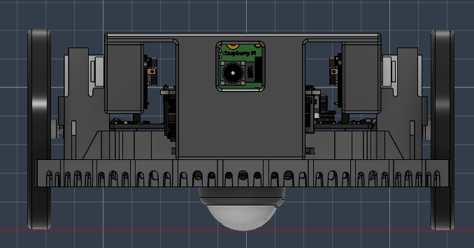
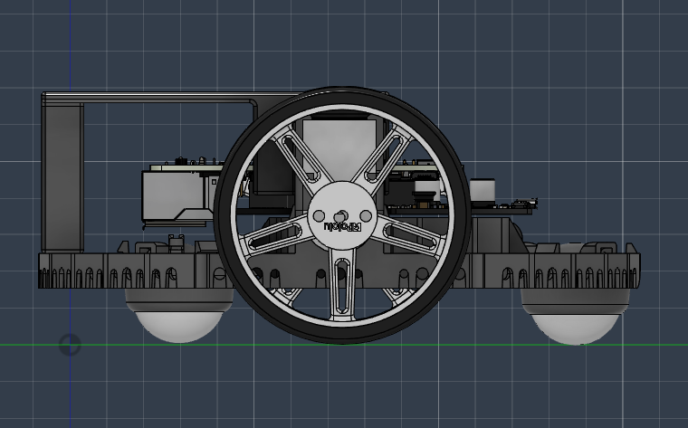
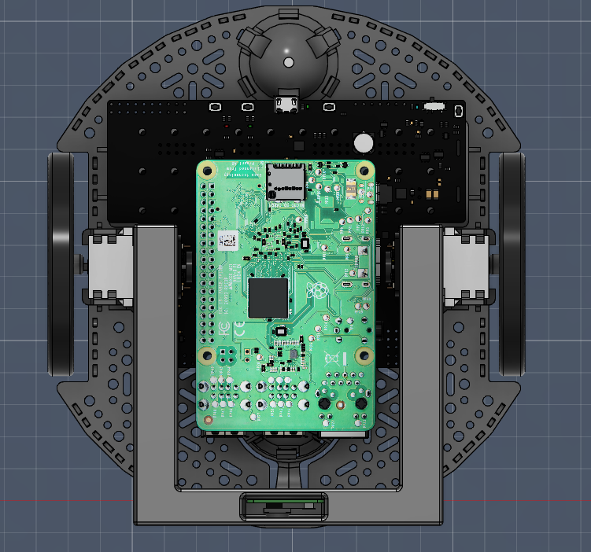
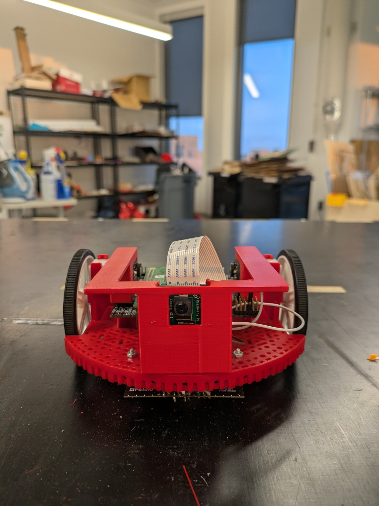
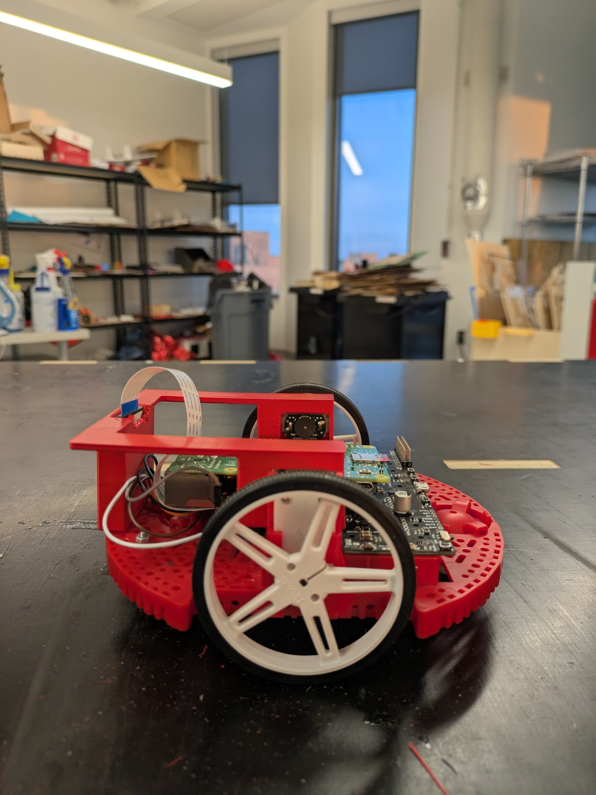
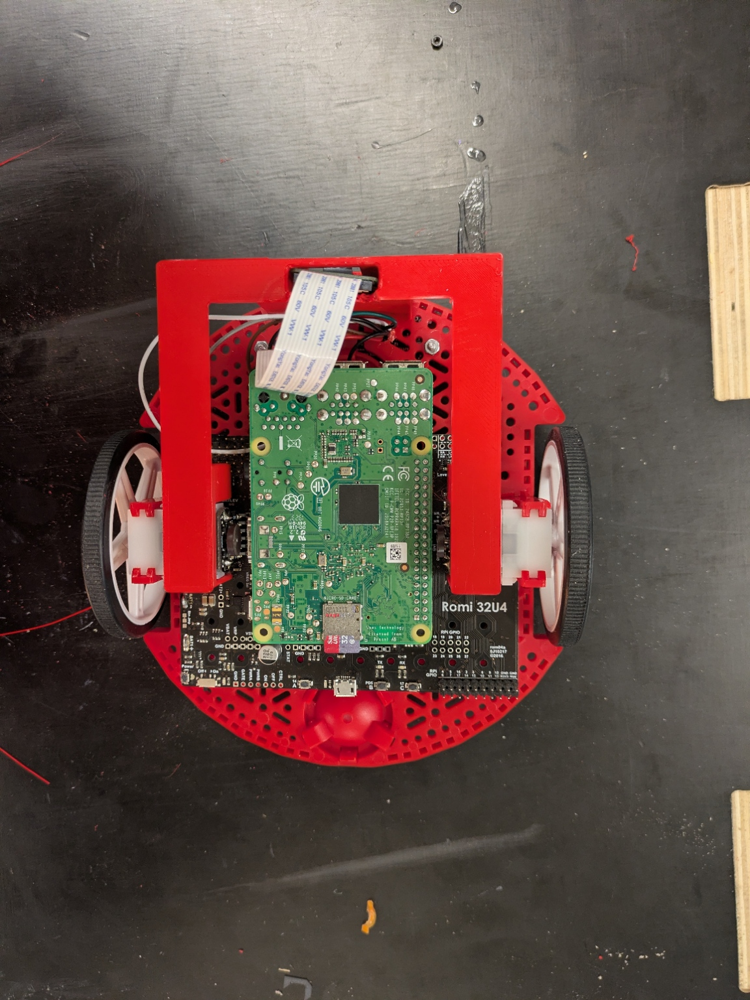

# Lab 6 – Camera Mount Design (Frictionless Design)

## Overview
This project focuses on the design and implementation of a custom camera mount for the Pololu Romi 32U4 robot to enable future vision-based navigation. The mount supports integration of a Raspberry Pi Camera V2.1 and was designed using Fusion 360, then fabricated and mounted onto the robot platform.

The work emphasizes mechanical design, system integration, and ensuring accurate and reliable camera positioning for applications such as ARUCO marker detection and autonomous navigation.

---

## Objective
- Design a stable mount for a Raspberry Pi Camera V2.1  
- Ensure proper camera alignment for vision-based tasks  
- Integrate the mount within the physical constraints of the Romi platform  
- Apply CAD-based design principles to a real embedded system  

---

## Design Approach

### Frictionless Design
The mount was developed using a **frictionless design approach**, minimizing unnecessary mechanical constraints and ensuring clean integration with the robot. This approach:

- Reduces stress on components  
- Improves alignment with system geometry  
- Simplifies assembly and integration  
- Enhances overall structural stability  

---

## Design & Implementation

### CAD Design (Fusion 360)
The camera mount was modeled in Fusion 360 with careful consideration of spatial constraints, ensuring:

- Camera is centered along the robot’s centerline  
- Camera is positioned approximately 2 inches above the ground  
- Mount remains within the robot’s footprint  
- Camera is protected from external impacts  

  
  
  

---

### Final Implementation (Real Robot)
The design was fabricated and successfully integrated onto the Romi robot. The final system maintains structural integrity while supporting a **frictionless design**, enabling stable and efficient mounting without unnecessary mechanical interference.

  
  
  

---

## System Integration
The final system integrates multiple subsystems:

- **Mechanical:** Camera mount and chassis structure  
- **Embedded:** Raspberry Pi and control hardware  
- **Sensing:** Camera module for perception  

This integration enables future expansion into vision-based robotics and autonomous navigation systems.

---

## Results
- Successfully designed and mounted a functional camera system  
- Achieved accurate camera alignment for vision applications  
- Maintained durability within real-world constraints  
- Created a platform ready for computer vision integration  

---

## What I Learned
- Designing mechanical systems under real-world constraints  
- The importance of spatial alignment in robotics systems  
- How mechanical design impacts sensing and perception  
- Integrating CAD-based design with embedded platforms  

---

## Future Improvements
- Add adjustable camera angle for field-of-view tuning  
- Optimize design for reduced weight and material usage  
- Improve cable routing and management  
- Introduce vibration damping for more stable image capture  

---

## Repository Context
This lab is part of a larger Romi Autonomous Vehicle project, which combines embedded systems, control theory, and hardware design to build a fully integrated robotics platform.
